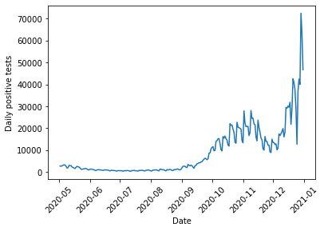
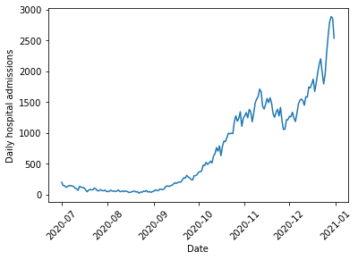
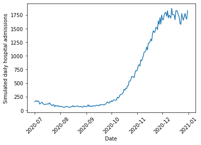
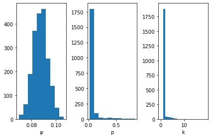
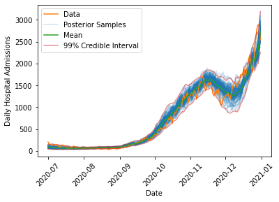

# Modélisation de la relation entre tests positifs et hospitalisation.
Modélisation des hospitalisations causées par le COVID 19 en Angleterre. 

### Données

Le Royaume-Uni a un <a href="https://coronavirus-data-gov-uk.translate.goog/?_x_tr_sl=auto&_x_tr_tl=fr&_x_tr_hl=fr">site web de données COVID-19</a> avec une API publique permettant d'examiner le nombre quotidien de test COVID-19, les admissions à l'hôpital, les décès et d'autres statistiques concernant la pandémie.
Durant ce projet je m'intéresse, essentiellement à déterminer la relation qu'il y a entre les tests positifs et les admissions à l'hôpital quelques temps plus tard. 
Parce que les tests n'étaient pas toujours cohérents au début de la pandémie, je concentre mon analyse sur la "deuxième vague" d'automne, et j'utilise les données concernant les test positifs à partir de mai 2020, l'idée est d'avoir une fenêtre de 60 jours pour lier les admissions à l'hôpital avec les tests. Cela permet de prendre en compte la possibilité d'un long délai de corrélation asynchrone.

De même, puisque les premières doses ont été administrées fin décembre 2020 en Angleterre, nous avons coupé notre période d'analyse au 31 décembre 2020, afin d'être certain que nous adaptons le modèle à une période 
où aucun vaccin n'avaient été administrés.

### Modèle

Pour examiner les admissions à l'hôpital, nous devons développer un modèle qui prédit deux choises:

- Combien d'admission en hôpital en fonction du nombre de test COVID positif ?
- Quand ces admissions à l'hôpital se produisent ? 

Pour répondre à ces questions je procède de la façon suivante.
1. Tous les test positifs ont une probabilité fixe ψ d'être suivi par une hospitalisation à une date ultérieure.
2. Pour ceux qui seront admis à l'hôpital, nous dévons déterminer quand la personne sera hôspitaliser. Pour modéliser la date d'admission je procède comme suit:
- Chaque jour, un patient atteint du COVID 19 qui nécessitera éventuellement une hospitalisation a une probabilité fixe p de l'aggravation de leur état.
- Une fois que leur état s'est aggravé k fois, ils sont admis à l'hôpital.
- Ce processus suit une <b> distribution binomial négative</b>, décalée de k jours. Une façon équivalente de voir cela est de dire que la date d'admission à l'hôpital suit une distribution multinomiale.

Une distribution binomiale négative décrit le nombre d'essaies de Bernoulli réussis attendu avant d'obtenir un nombre fixe d'échecs. Dans notre cas ici il s'agit du nombre de jours passé pour une personne atteinte du COVID avant d'obtenir k aggravation succésive.

Une fois que nous pouvons prédire le nombre d'admissions à l'hôpital et quand elles se produisent, il nous suffit de fournir au modèle le nombre de tests positifs chaque jour et le modèle produira une prédiction du nombre d'dmissions à l'hôpital chaque jour. Ceci peut ensuite comparé aux données pour estimes les valeurs de ψ,p et k.

### Inférence bayésienne

Pour ajuster le modèle et tenir compte de l'incertitue j'utilise l'inférence bayésienne. L'idée est calibrer les paramètres de notre modèle θ=(ψ,p,k) de tel sorte qu'ils collent le plus à nos données. Pour calibrer nos paramètres nous utilisons la règle de bayes:

  

Nous devons spécifier nos croyances initales sur ce que nous pensons être des paramètres de modèle raisonnables. Je fais l'hypothèse (conforme aux données) qu'une fraction faible des tests positifs entraîne des hospitalisations. Je peux quantifier cela grâce à une distribution bêta, une distribution flexible bien adaptée à la modélisation de paramètres qui sont contraints entre  0 et 1. Les distributions bêta ont deux paramètres de forme α et β qui contrôlent où la distribution a la densité la plus élevée. Ainsi nous souhaitons que notre paramètre ψ soit de faible probabilité, donc nous choisissons α = 0.5 et β = 2, ce qui place la majeur partie de la masse de distribution à des valeurs plus petites.

Pour k et p, nous utilisons une distribiution uniforme ainsi nous excluons aucun scénario, une distribution uniforme discrète pour k entre 1 et 20 et une distribution Béta avec  α = 1 et β = 1.

Pour approximer la vraisemblance    j'utilise la calcul bayésien approximatif.
Plutôt que d'exiger que le modèle proposé produise le même ensemble d'admissions à l'hôpital que celui observé dans les données, nous essaierons plutôt de trouverun modèle assez proche des données. J'utiliserai également une mesure gaussienne de dissemblance qui pénalise les modèles qui montrent une grande différence entre les données réelles et les prédictions du modèles.

### Échantillonnage séquentiel de Monte Carlo

Comme discuté ci-dessus, plutôt que de calculer le postérieur directement, nous en tirerons des échantillons. Pour ce faire, nous utiliserons une technique connue sous le nom d'échantillonnage de Monte Carlo séquentiel (SMC) ou, dans d'autres contextes, de Monte Carlo par chaîne de Markov de particules. SMC est une méthode d'échantillonnage à partir d'une distribution inconnue (la distribution postérieure) en échantillonnant à la place à partir d'une distribution connue (la distribution antérieure), puis en ré-échantillonnant en fonction des poids déterminés à partir de la vraisemblance calculée×\fois×avant pour chaque échantillon. Plus le poids d'un échantillon particulier est élevé, plus la probabilité qu'il soit ré-échantillonné et reste dans l'ensemble d'échantillons pris à l'étape suivante est élevée. Ainsi, au fil du temps, les échantillons où la postérieure est la plus élevée seront transmis à plusieurs reprises à l'étape suivante, tandis que ceux où la postérieure est plus basse seront supprimés.

En plus du rééchantillonnage, qui garantit que les bons échantillons sont susceptibles d'apparaître dans les étapes successives, SMC perturbe également les échantillons à chaque étape en utilisant une marche aléatoire de Markov Chain Monte Carlo pour s'assurer que la méthode explore les régions entourant les bons échantillons. La trempe et l'exploration peuvent être réglées de manière adaptative en fonction des résultats de l'échantillonnage pour essayer d'optimiser le nombre d'étapes nécessaires pour se déplacer entre l'antérieur et le postérieur. Cela permet d'équilibrer la précision de l'échantillonnage avec le coût de calcul.

### Résultats

Tout d'abord, nous pouvons examiner les échantillons postérieurs pour en savoir plus sur le type de modèle qui correspond aux données. On voit que ψ un pic autour de 9%, ce qui signifie que la proportion de tests positifs conduit à une hospitalisation. La distribution est assez serrée autour de cette valeur, il n'y a donc pas beaucoup d'incertitude sur ce paramètre.

Pour ppp et kkk, on voit que la plupart des échantillons ont tendance à privilégier les faibles ppp, meugler kkkmodèle décrit ci-dessus. Comme indiqué précédemment, il ne s'agit pas nécessairement d'un modèle réaliste de l'évolution d'une infection, mais plutôt d'un moyen de comprendre l'incertitude entourant le moment où un patient entre à l'hôpital. Ce qui est important, c'est qu'il existe une variabilité dans le moment où nous nous attendons à ce que des tests positifs un jour donné conduisent à des hospitalisations ultérieures.

### Prédictions à posteriori.

Le modèle est capable de capturer la dynamique globale de la vague de l'automne 2020, y compris l'augmentation des admissions en octobre 2020, la diminution fin novembre 2020 en raison du deuxième verrouillage national qui a commencé le 5 novembre 2020, et la hausse continue jusqu'à Noël 2020 lorsque le troisième confinement national est entré en vigueur le 6 janvier 2021.

Fait intéressant, le modèle a du mal à capturer le moment de la diminution à la fin du deuxième verrouillage, où les données réelles s'éloignent de l'intervalle de 99% sur les échantillons postérieurs. L'une des raisons pour lesquelles cela pourrait se produire est que pendant le deuxième verrouillage, les écoles sont restées en session, tandis que la plupart des autres secteurs non essentiels de l'économie ont été contraints de fermer. Cela signifie que les jeunes enfants ont probablement vu leur exposition au COVID diminuer moins fortement que la plupart des adultes (dont beaucoup restaient simplement à la maison et n'allaient pas travailler). Cela a probablement changé les données démographiques sous-jacentes de la population testée positive pour fausser les plus jeunes. Nous nous attendons à moins d'hospitalisations dans une population plus jeune, ce qui pourrait expliquer la baisse plus rapide des admissions fin novembre 2020 dans les données réelles par rapport aux simulations.Cela semble être une caractéristique cohérente de tous les modèles ajustés aux données, ce qui suggère qu'il s'agit d'un changement dans les données plutôt que d'une lacune du modèle.

### Prédire la vague du printemps 2021

Comme nous pouvons le voir, le modèle prédit beaucoup plus d'hospitalisations (d'un facteur d'environ 4 à 5) que ce qui est observé dans les données, ce qui donne du crédit à l'affirmation selon laquelle le lien entre les infections et les hospitalisations s'était affaibli. De plus, l'incertitude dans la prédiction est beaucoup plus petite que les différences observées, ce qui suggère que cela devrait être dû à un coup de chance extrêmement rare s'il n'y avait eu aucun changement dans la population sous-jacente exposée au COVID. A noter également que les fluctuations du nombre d'hospitalisations prévues à l'été 2021 sont assez importantes (environ une différence de 1000 entre les estimations les plus basses et les plus élevées).Cela suggère que malgré des mois de données sur les infections et les hospitalisations, il existe encore une incertitude considérable quant à la compréhension des soins hospitaliers dont une population exposée au COVID aura besoin. Cela devrait souligner la nécessité d'un examen attentif des hypothèses de modélisation qui sont faites dans toute prévision de l'effet d'une maladie infectieuse émergente et incertaine sur les membres vulnérables d'une population.

### Discussion

Comme mentionné ci-dessus, nous avons vu que le modèle avait des difficultés à gérer les données lors du deuxième verrouillage national, et une explication possible était un changement dans la population testée positive. En effet, au cours de la période considérée, les écoles étaient ouvertes tandis que d'autres secteurs de l'économie restaient soumis à des restrictions, ce qui signifie qu'il est possible que davantage de tests dans les écoles soient en partie responsables de cette différence. Étant donné que les jeunes ont été vaccinés plus tard que la population âgée au printemps/été 2021, nous nous attendrions à ce qu'avec le temps, la population testée positive soit progressivement plus jeune, ce qui pourrait expliquer une partie de la réduction des hospitalisations au cours du printemps/été 2021. Cependant, nous pouvons potentiellement estimer l'ampleur de cet effet en regardant les données de novembre 2020,ce qui montre une réduction de quelques centaines d'hospitalisations. Ceci est considérablement plus petit que les différences observées, il est donc peu probable qu'il explique l'écart complet entre le modèle et les données.

Étant donné que nous sommes convaincus que les données diffèrent des prévisions, comment pourrions-nous expliquer les vaccinations ? Une possibilité est de faire ψ non plus une constante, mais plutôt une fonction des taux de vaccination à dose unique et double, éventuellement avec un décalage dans le temps pour permettre à l'immunité de se développer. Nous pourrions également adapter trois différents ψ valeurs pour 0, 1 ou 2 doses de vaccin, bien que comme les personnes vaccinées soient moins susceptibles que les personnes non vaccinées d'être infectées, nous aurions également besoin d'estimer les risques d'infection, ce qui est susceptible d'être difficile. Cela est particulièrement vrai du fait que les taux d'infection peuvent être très hétérogènes localement, car des poches de la population avec plus ou moins de couverture vaccinale verront des taux d'infection très différents.

Quelle que soit la cause exacte de cette diminution du risque d'hospitalisation, l'évolution des données montre clairement que cette vague de pandémie diffère des précédentes. Alors que le gouvernement britannique modifie ses politiques pour apprendre à vivre avec le virus, plutôt que de le supprimer activement, les données sur les infections et les hospitalisations continueront de fournir des informations précieuses sur l'évolution de la pandémie et devraient guider nos décisions et notre comportement. Espérons que ce modèle fournit un exemple de la façon dont cela peut être fait avec un œil pour construire des modèles simples et interprétables qui tiennent compte de l'incertitude de manière robuste.
